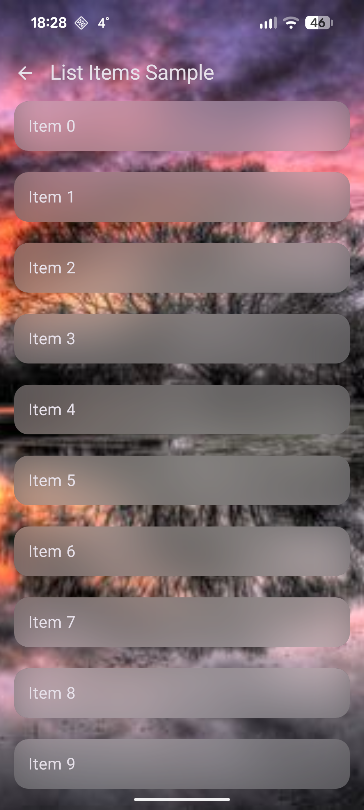
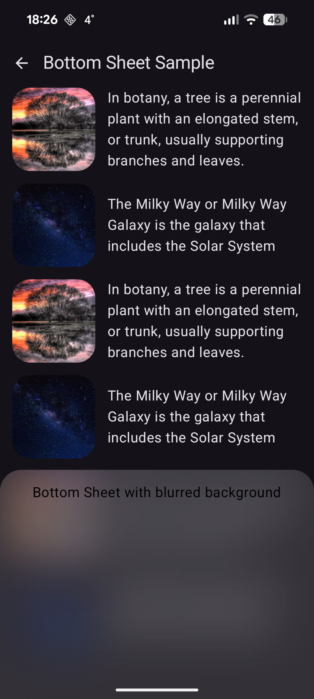
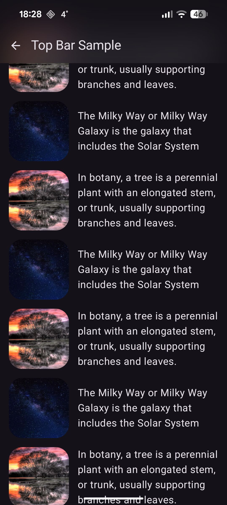

# glassmorphism-compose
This library provides glassmorphism effect for Jetpack Compose. It uses `androidx.compose.ui.graphics.BlurEffect` to create blur under the hood.

## Examples
<div style="display: flex; gap: 10px;">
    
    
    
</div>

## Usage
```kotlin
Box(Modifier.fillMaxSize()) {

    // create instance of BlurHolder (used to connect background content with overlapping content)
    val blurHolder = rememberBlurHolder()

    ExampleBackgroundContent(
        modifier = Modifier
            .fillMaxSize()
            // Use blurredContent to indicate that content of this Composable must be blurred where it is overlapped
            .blurredContent(blurHolder),
    )

    ExampleDialog(
        modifier = Modifier
            .align(Alignment.Center)
            .size(200.dp)
            // Use blurredBackground for an overlapping Composable to make its background blurred
            .blurredBackground(
                blurHolder = blurHolder,
                blurRadius = 24.dp,
                color = Color.Black.copy(alpha = 0.25f),
                shape = RoundedCornerShape(16.dp),
            ),
    )
}
```

You can find more examples of usage [here](samples/src/commonMain/kotlin/io/github/neilyich/glassmorphism/samples).

## Download


```kotlin
repositories {
    mavenCentral()
}

dependencies {
    implementation("io.github.neilyich:glassmorphism-compose:<version>")
}
```
